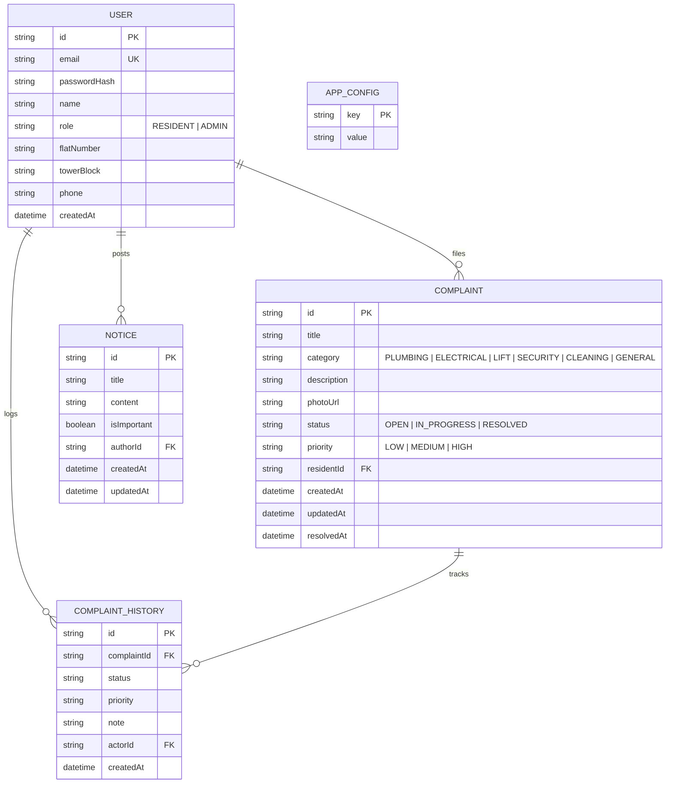

# 🏢 Greenview Heights — Society Maintenance Tracker

> A full-stack apartment society maintenance and facility management web application designed for transparent complaint resolution, verifiable audit logs, photo evidence, community notice boards, and automated overdue ticket detection.

🌐 **Live Production Application:** [https://society.rejit.in](https://society.rejit.in)

---

## 🌟 Key Features

1. **Role-Based Portals & Profiles**:
   - **Residents**: Log complaints, attach photo evidence, view real-time status audit history, and access community notices.
   - **Administrators**: Comprehensive facility dashboard, overdue ticket prioritization, technician assignment notes, priority escalation, and notice board management.
2. **Event-Sourced Complaint History**:
   - Every status progression (`OPEN` $\rightarrow$ `IN_PROGRESS` $\rightarrow$ `RESOLVED`) is atomically recorded with the actor's identity, timestamp, and technician notes.
3. **Dynamic Overdue Detection**:
   - Automatically computes elapsed ticket age against an administrator-configurable threshold (default: 3 days) and prioritizes overdue tickets to the top of the admin feed.
4. **Photo Upload Pipeline**:
   - Drag-and-drop & mobile camera photo capture saved to disk storage with UUID obfuscation and 5MB validation.
5. **Community Notice Board**:
   - Pinned announcements with automated email notifications broadcast to all residents.
6. **Warm Residential Design System**:
   - Tailored warm terracotta and stone palette (`#FAF8F5`, `#D05A3F`, `#EADBCC`), 48px touch targets for mobile thumb interaction (Fitts's Law), and high-contrast semantic badges.
7. **Dual-Mode Email Engine**:
   - Nodemailer support with live SMTP and graceful in-memory dev logger fallback.

---

## 🔑 Pre-Seeded Demo Credentials

Use the 1-click login buttons on the Sign In page or enter manually:

| Role | Email Address | Password | Details |
| :--- | :--- | :--- | :--- |
| **Society Admin** | `admin@greenview.com` | `admin123` | Full dashboard, notice publisher, status editor |
| **Resident (402)** | `resident@greenview.com` | `resident123` | Tower B • Flat 402 (Ananya Sharma) |
| **Resident (101)** | `rohit@greenview.com` | `resident123` | Tower A • Flat 101 (Rohit Mehta) |

---

## 🚀 Quick Start / Local Installation

### Prerequisites
- Node.js 18+ installed
- npm or yarn

### 1. Clone & Install Dependencies
```bash
git clone <repository-url>
cd society_maintenance_tracker
npm install
```

### 2. Configure Environment
```bash
cp .env.example .env
```

### 3. Initialize & Seed Database
```bash
npx prisma db push
npm run db:seed
```

### 4. Run Development Server
```bash
npm run dev
```
Open [http://localhost:3000](http://localhost:3000) in your browser.

---

---

## 🐳 Production Deployment & Architecture

The live application is hosted at **[https://society.rejit.in](https://society.rejit.in)**, running as a containerized Docker service behind a dedicated **Caddy Ingress Reverse Proxy** on a shared Docker bridge network (`web_net`).

```
                    [ Internet (society.rejit.in) ]
                                   │
                                   ▼  (Ports 80 & 443)
                ┌───────────────────────────────────────┐
                │    ~/caddy/ (Dedicated Caddy Ingress) │
                └───────────────────┬───────────────────┘
                                    │
              ┌─────────────────────┴─────────────────────┐
              │         Shared Docker Network: web_net    │
              └───────────┬─────────────────┬─────────────┘
                          │                 │
                          ▼                 ▼
           ┌──────────────────────┐  ┌──────────────────────┐
           │     ~/sample-app/    │  │     ~/soc-track/     │
           │    (Other Service)   │  │   (Soc Track App)    │
           │     Port 3001        │  │     Port 3000        │
           └──────────────────────┘  └──────────────────────┘
```

### 1. Cloudflare DNS Setup
To route your domain to the server:
- **Type:** `A`
- **Name:** `society` (or `society.example.com`)
- **IPv4 Address:** `<YOUR_SERVER_IP>`
- **Proxy Status:** Proxied (Orange Cloud) or DNS-Only (Grey Cloud)
> **Note:** Do NOT put port numbers in Cloudflare DNS. Caddy automatically handles port routing and SSL certificates.

### 2. Caddy Reverse Proxy Configuration (`~/caddy/Caddyfile`)
```caddyfile
# Society Maintenance Tracker
society.example.com {
    reverse_proxy soc_track_app:3000
}

# Secondary Microservice / Example App
service2.example.com {
    reverse_proxy sample_app:3001
}
```

### 3. One-Command Production Deployment
Run the automated deployment script locally:
```bash
chmod +x deploy.sh
./deploy.sh
```

This script:
1. Builds the production Docker image locally.
2. Pushes to Google Artifact Registry: `us-west1-docker.pkg.dev/<PROJECT_ID>/<REPO_NAME>/soc-track:latest`.
3. Sets up `~/soc-track/` on the VM with persistent volumes for SQLite and media uploads.
4. Pulls and launches the container attached to `web_net`.

### 4. Local Docker Testing
To run the container locally:
```bash
docker compose up --build
```
Access the application locally at [http://localhost:3002](http://localhost:3002).

### 5. Database Utilities
- **Download live backup from production**:
  ```bash
  chmod +x pull-from-vm-to-db.sh
  ./pull-from-vm-to-db.sh
  ```
  Safely pulls `dev.db` from the VM into `prisma/dev.db` with an automated timestamped backup in `./backups/`.

- **Push local DB to production (Initial Setup only)**:
  ```bash
  chmod +x push-db-to-vm.sh
  ./push-db-to-vm.sh
  ```

---

## 📖 API Documentation

### Authentication Endpoints
| Method | Endpoint | Description | Request Body |
| :--- | :--- | :--- | :--- |
| `POST` | `/api/auth/login` | Sign in with email & password | `{ "email": "...", "password": "..." }` |
| `POST` | `/api/auth/register` | Register new resident | `{ "name": "...", "email": "...", "password": "...", "flatNumber": "...", "towerBlock": "..." }` |
| `GET` | `/api/auth/me` | Get current logged-in session | _Cookie header_ |
| `POST` | `/api/auth/logout` | Clear authentication cookie | _None_ |

### Complaint Endpoints
| Method | Endpoint | Description | Query / Body |
| :--- | :--- | :--- | :--- |
| `GET` | `/api/complaints` | Fetch complaints (filtered by role) | `?category=...&status=...&priority=...&search=...` |
| `POST` | `/api/complaints` | Submit a new complaint | `{ "title": "...", "category": "...", "description": "...", "photoUrl": "..." }` |
| `GET` | `/api/complaints/:id` | Fetch complaint with full audit trail | _None_ |
| `PATCH` | `/api/complaints/:id` | Update status, priority & append note | `{ "status": "IN_PROGRESS", "priority": "HIGH", "note": "..." }` |

### Photo Upload
| Method | Endpoint | Description | Payload |
| :--- | :--- | :--- | :--- |
| `POST` | `/api/upload` | Upload supporting photo (5MB max) | `multipart/form-data` with `file` |

### Notice Board Endpoints
| Method | Endpoint | Description | Payload |
| :--- | :--- | :--- | :--- |
| `GET` | `/api/notices` | List all community circulars | _None_ |
| `POST` | `/api/notices` | Post new notice (Admin only) | `{ "title": "...", "content": "...", "isImportant": true }` |
| `DELETE`| `/api/notices/:id` | Remove a notice (Admin only) | _None_ |
| `PATCH` | `/api/notices/:id` | Toggle pinned notice status | `{ "isImportant": true }` |

### Analytics & Configuration
| Method | Endpoint | Description |
| :--- | :--- | :--- |
| `GET` | `/api/stats` | Facility dashboard metrics, resolution rate, category stats |
| `GET` | `/api/config` | Get overdue threshold days |
| `PATCH`| `/api/config` | Update overdue threshold days (Admin only) |

---

## 🗄️ Database Schema & Data Models



---

## 🧪 Automated Testing
Run the test suite:
```bash
npm test
```
Verifies role authentication, complaint creation, audit trail generation, status transitions, and overdue calculations.
