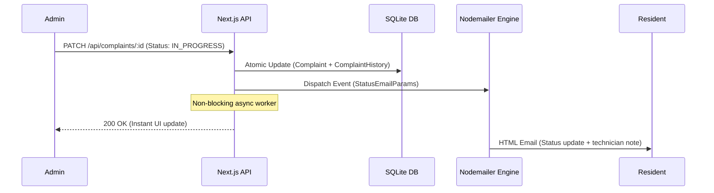

# System Design: Society Maintenance Tracker

## 1. Overview & Architecture
The **Society Maintenance Tracker** is an enterprise-grade, mobile-first facility management platform for apartment complexes. Built with Next.js 14 (App Router), TypeScript, Tailwind CSS, and Prisma ORM with SQLite, the system bridges communication gaps between residents and administrators through structured workflows, verifiable audit logs, automated overdue alerting, and multichannel notifications.

```
┌────────────────────────────────────────────────────────┐
│               Client / Browser (Next.js)               │
│      [Resident Portal]          [Admin Dashboard]      │
└───────────────────────────┬────────────────────────────┘
                            │ HTTPS / REST / JSON
┌───────────────────────────▼────────────────────────────┐
│                  Next.js App API Layer                 │
│   Auth (JWT) │ Complaints │ Notices │ Stats │ Config   │
└─────────────┬─────────────┬─────────────┬──────────────┘
              │             │             │
              ▼             ▼             ▼
      ┌──────────────┐┌────────────┐┌────────────┐
      │ SQLite (DB)  ││ Disk (FS)  ││ Nodemailer │
      │ State+Events ││  Uploads   ││ Email Svc  │
      └──────────────┘└────────────┘└────────────┘
```

---

## 2. Complaint History Model
A primary evaluation pillar of this platform is the distinction between mutable entity state and immutable event history.

### State Snapshot vs. Event Sourcing Pattern
- **`Complaint` (Current Snapshot)**: Stores the immediate runtime state (`status`, `priority`, `category`, `photoUrl`, `residentId`). Querying open tickets, filtering categories, or computing analytics operates in $O(1)$ indexed reads without scanning historical records.
- **`ComplaintHistory` (Append-Only Event Log)**: Every lifecycle transition (`OPEN` $\rightarrow$ `IN_PROGRESS` $\rightarrow$ `RESOLVED`) appends a permanent log entry containing:
  - `complaintId`: Relational foreign key referencing the ticket with `ON DELETE CASCADE`.
  - `status` & `priority`: State snapshot at the time of change.
  - `actorId`: Foreign key resolving to the specific user (Admin or Resident) who executed the transition.
  - `note`: Contextual technician or resident note (e.g. *"Otis technician scheduled for 3:00 PM"*).
  - `createdAt`: Immutable ISO timestamp.

### Transactional Consistency
All status and priority mutations are wrapped in atomic database transactions (`prisma.$transaction`). The complaint state update, audit log insertion, and notification trigger occur together, guaranteeing zero state drift or unrecorded transitions. When a complaint is marked `RESOLVED`, the system automatically closes the ticket and sets `resolvedAt`.

---

## 3. Overdue Detection Engine
Complaints lingering without resolution are a major friction point in residential management. The platform features dynamic overdue calculation with prioritized queue surfacing.

### Algorithmic Formula
$$\text{Age}_{\text{days}} = \left\lfloor \frac{t_{\text{now}} - t_{\text{created}}}{1000 \times 60 \times 60 \times 24} \right\rfloor$$
$$\text{IsOverdue} = (\text{status} \neq \text{RESOLVED}) \land (\text{Age}_{\text{days}} \ge \text{Threshold}_{\text{days}})$$

### Dynamic Runtime Thresholding
Rather than hardcoding threshold values, the limit is persisted in the database (`AppConfig.overdue_threshold_days`, default = 3 days). Administrators can dynamically adjust this value from the Settings interface without code redeployment or server restarts.

### Prioritized Sorting Hierarchy
The Admin Queue automatically prioritizes tickets based on urgency:
1. **Tier 1 (Critical)**: Overdue unresolved complaints sorted by elapsed age descending (oldest surfaced first).
2. **Tier 2 (High Priority)**: Active High Priority tickets.
3. **Tier 3 (Standard)**: Active normal tickets sorted by recency.
4. **Tier 4 (Resolved)**: Closed tickets with resolution notes.

---

## 4. Photo Handling Architecture
Visual evidence reduces miscommunication and accelerates technician dispatch.

### Local Disk Storage with UUID Obfuscation
1. **Upload Pipeline**: Resident selects or captures an image through the mobile camera dropzone (`POST /api/upload`).
2. **MIME Validation & Size Guard**: The backend validates MIME headers (`image/jpeg`, `image/png`, `image/webp`) and enforces a strict $5\text{MB}$ file cap.
3. **Collision-Free Storage**: Files are renamed with cryptographically secure UUIDs (`crypto.randomUUID() + ext`) and written to the persistent local disk directory (`public/uploads/`).
4. **Zero Cloud Dependency**: Eliminates reliance on external paid S3 buckets while enabling self-hosted portability in standalone VPS and Docker environments.

---

## 5. Notification & Email Flow
The system keeps residents informed through automated, non-blocking transactional emails.



### Multichannel Triggers
- **Status Progression**: Dispatches styled HTML emails when ticket status transitions (`Open` $\rightarrow$ `In Progress` $\rightarrow$ `Resolved`) with technician notes.
- **Pinned Notice Broadcast**: When an administrator publishes an announcement with `isImportant: true`, an automated broadcast is dispatched to all registered residents.

### Resilience & Dual-Mode Transport
The notification engine incorporates a graceful fallback: if live SMTP credentials (`SMTP_HOST`, `SMTP_USER`, `SMTP_PASS`) are configured, emails are transmitted over TLS; if unconfigured, emails are routed to a safe console logger, ensuring that the application never crashes due to mail server timeouts.
